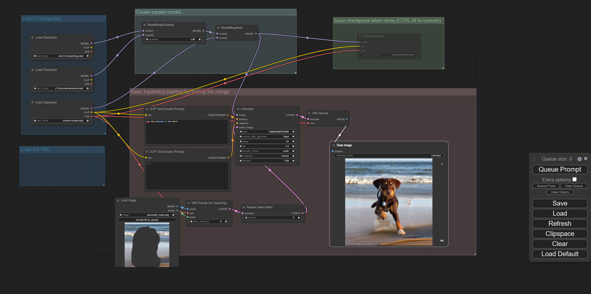
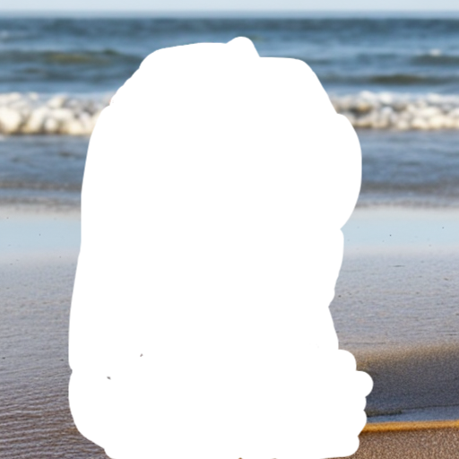

# Stable Diffusion Custom Dream booth Inpainting Model

# Steps to Reproduce the results

### 1. Install necesssary libraries mentioned in 01_Dream_Booth_Dog_model_training.ipynb and follow the notebook to train dream booth model for the specific dog. Note For the specific dog instance dataset, use the images curated in the dataset Dataset\Specific_Dog_Images_dataset folder for training.

# 2. The image dataset I made for that specific dog are as shown below (just used image outpainting and background change to create a variety) :

<table>
  <tr>
    <td></td>
    <td></td>
  </tr>
  <tr>
    <td></td>
    <td></td>
  </tr>
</table>
<h2>Images in the dataset.</h2>

# 3. Download these 3 models from the urls given below  : One custom dream booth model + 1 in painting and one stable diffusion model:

In Painting Model : https://huggingface.co/runwayml/stable-diffusion-inpainting/resolve/main/sd-v1-5-inpainting.ckpt?download=true  
Stable Diffusion 1.5 model : https://huggingface.co/runwayml/stable-diffusion-v1-5/resolve/main/v1-5-pruned-emaonly.ckpt?download=true  
Custom Dream booth Dog model : https://drive.google.com/file/d/1EEAb9r0oVJ_FyQ550F5AdiP8-BZHItmr/view?usp=sharing  
 
# 3. Now Start the Comfy UI workflow with final_workflow.json as shown below:

<figcaption ><h2>This ComfyUI workflow combines 3 models mentioned above to create an inpainting dreambooth model of the dog</h2></figcaption>

# 4. Results of Dreambooth in painting of the dog:

<figcaption ><h2>Input Masked image of a beach</h2></figcaption>
 

<table>
  <tr>
    <td></td>
    <td></td>
  </tr>
</table>
<figcaption ><h2>Generated outptus</h2></figcaption>